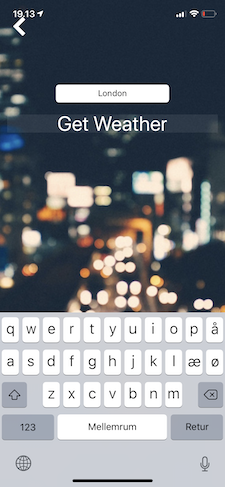

# Swift-Clima
Small and simple Clima app for iOS

User can enter the name of the city and see its current weather status and temperature

Requirements: Mac OSX, iOS Device, XCode 10.2

App Technical Details:

- Show the use of multiple View Controllers
- Work with Apple API's such GPS/CoreLocation
- Work with concepts such as Segues, Protocols, Delegates
- Pass data between View Controllers
- Handle user input
- Update app based upon incoming data
- Implement Dependencies into a Swift Project using CocoaPods
- Install dependencies
  - SwiftyJSON
    - To handle JSON elements in Swift
  - Alamofire
    - To communicate with internet resources and API's
  - SVProgressHUD
    - Not used actually
- Modify 'info.plist' to allow communication with http/non-https REST content 

Issues:

- Chance of a minor error in displaying the temperature
